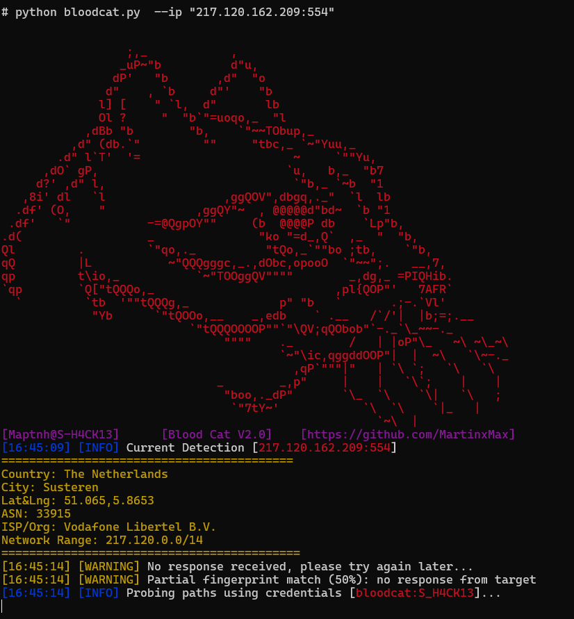

 

# Blood-Cat

A tool for hacking into publicly exposed network cameras, with support for specifying country and region

```
Version 2.0
[-] Remove tqdm library
[-] Remove multi-threaded mode, switch to single-threaded... to prevent Bloodcat's IP from being blocked by cameras
[+] New verification detection logic to reduce exposure risk and achieve precise targeting
[+] New fingerprinting with automatic CVE detection
[+] Perform geographical information analysis on incoming IPs
```



```
Version 1.5
[+] Fully automatic calculation of the optimal thread count, ensuring maximum efficiency without impacting system performance
[+] Expanded password list
[+] Added --password option for password spraying
[+] Update National Camera Data for AE AU BR CA CN DE FR GB IL IN JP RU SA SG US
```


```
Version 1.3
[+] Added a log output interface for a more elegant output display. 
[+] Added the --ips parameter to support importing multiple IP lists; in domain penetration, BloodCat can help you compromise more cameras.
```

 


---

# Install Dependencies

```bash
$ sudo apt update && sudo apt install ffmpeg
$ pip install geoip2 requests
```

---

# Usage

```bash
$ python3 bloodcat.py -h
```


---

## Bruteforce for  IP list

```bash
$ python3 bloodcat.py --ips target.txt
```


## Bruteforce a specific camera IP

```bash
$ python3 bloodcat.py --ip "80.191.192.230:554"
```


---

## Bruteforce camera IPs in a specific country/region (via FoFa)

```bash
$ python3 bloodcat.py --country CN --region HK --key <FOFA-API-KEY>
```


---

# File Path

All discovered results will be saved to:

```
./data/ipcam.info
```


---

# Launch Viewer

```bash
$ ./play.sh
```


 

