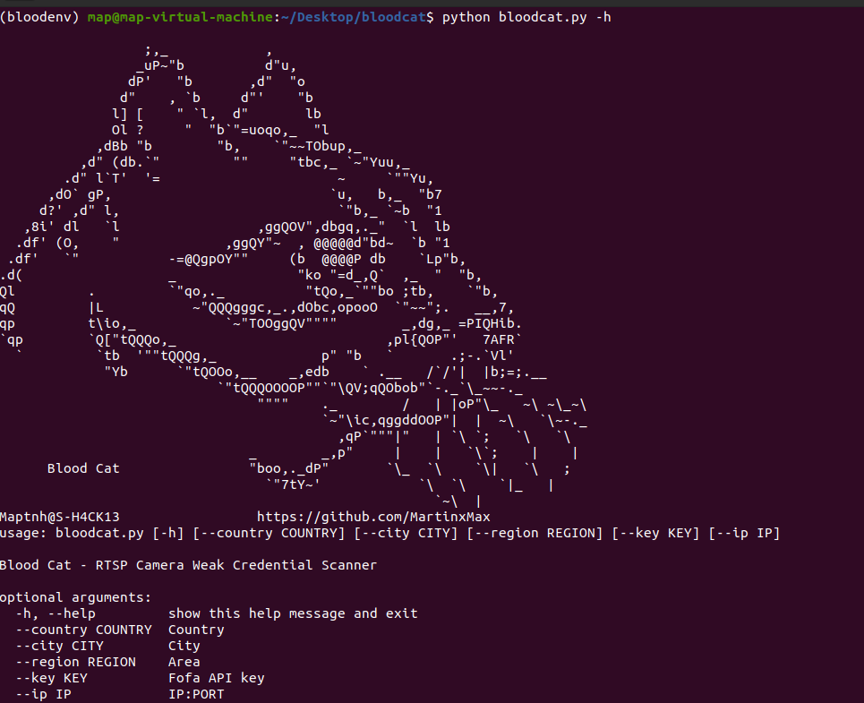
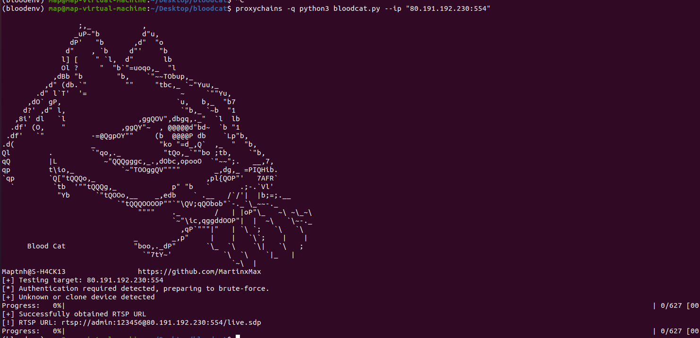
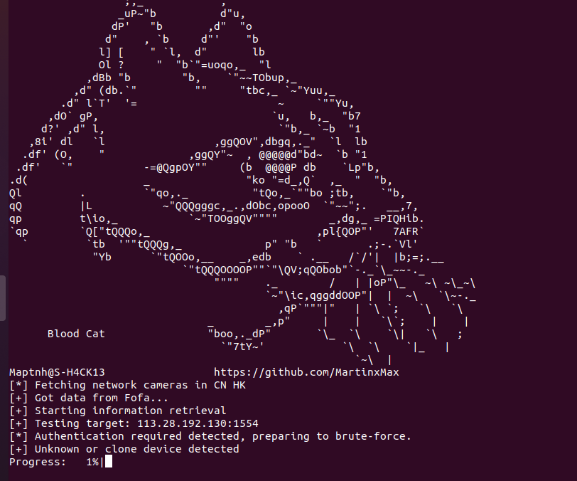
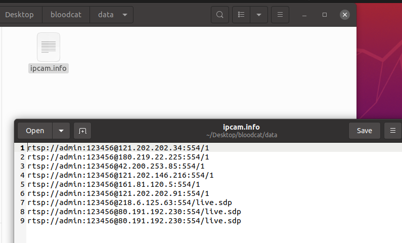

 

# Blood-Cat

A tool for collecting publicly exposed network cameras, with support for specifying country and region.

---

# Install Dependencies

```bash
$ sudo apt update && sudo apt install ffmpeg
$ pip install -r requirements.txt
```

---

# Usage

```bash
$ python3 bloodcat.py -h
```



---

## Bruteforce a specific camera IP

```bash
$ python3 bloodcat.py --ip "80.191.192.230:554"
```




---

## Bruteforce camera IPs in a specific country/region (via FoFa)

```bash
$ python3 bloodcat.py --country CN --region HK --key <FOFA-API-KEY>
```



---

# File Path

All discovered results will be saved to:

```
./data/ipcam.info
```



---

# Launch Viewer

```bash
$ ./play.sh
```


 