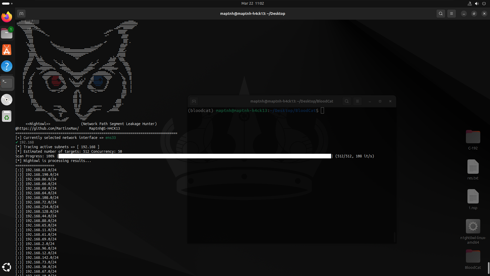
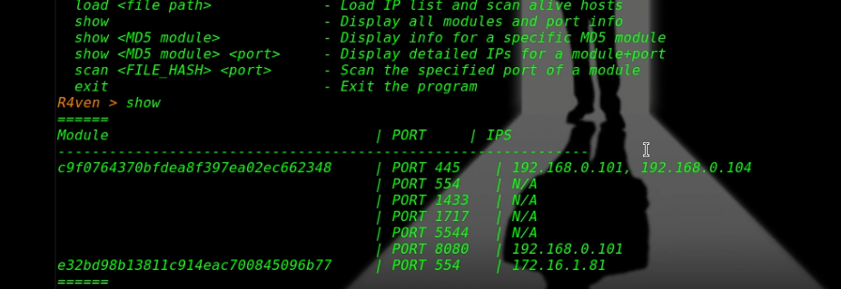
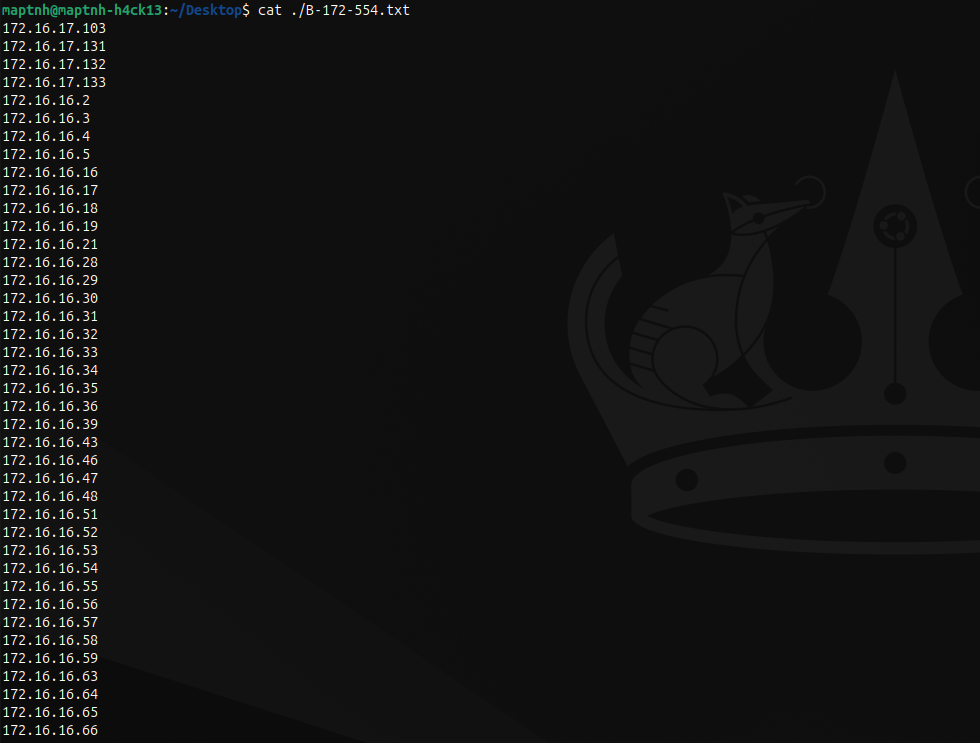
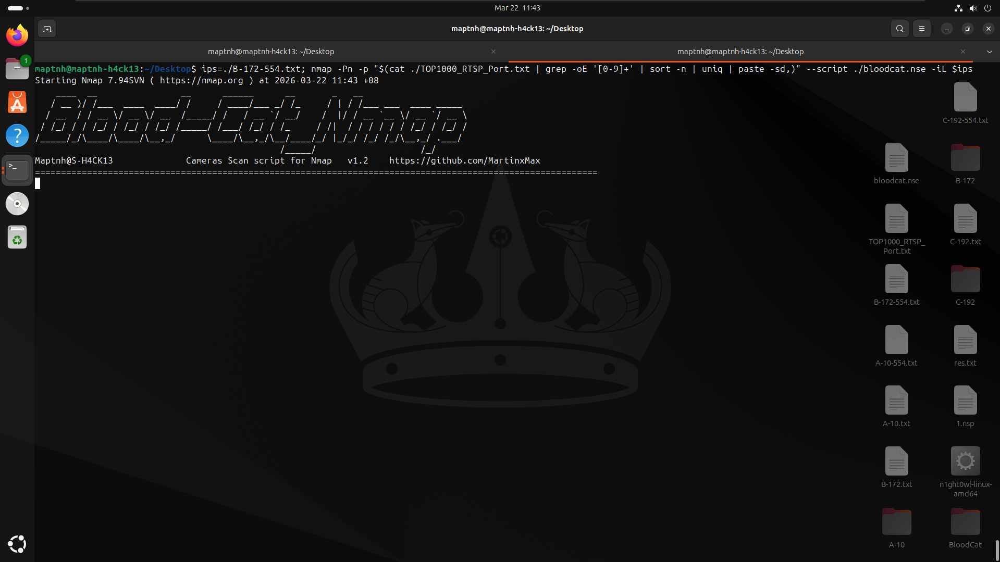
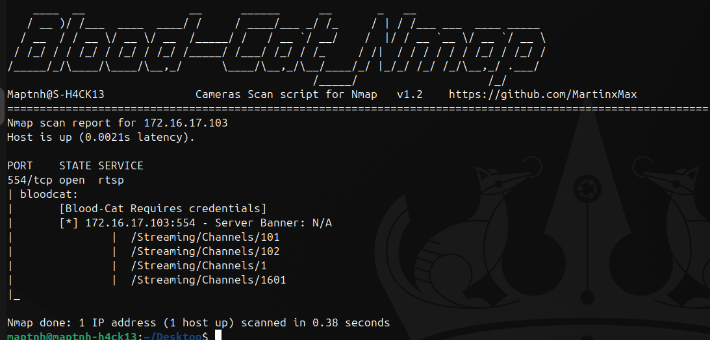
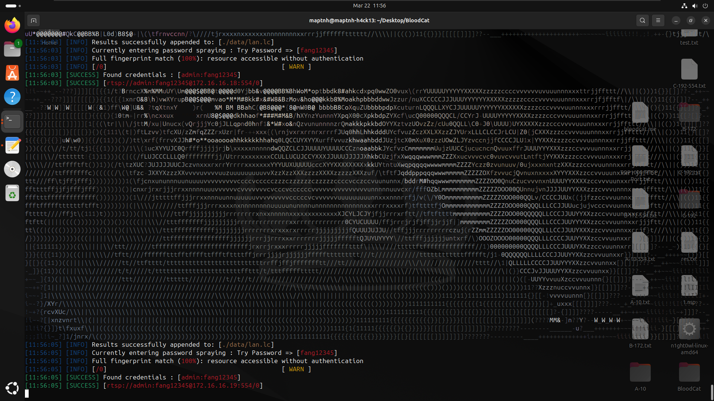
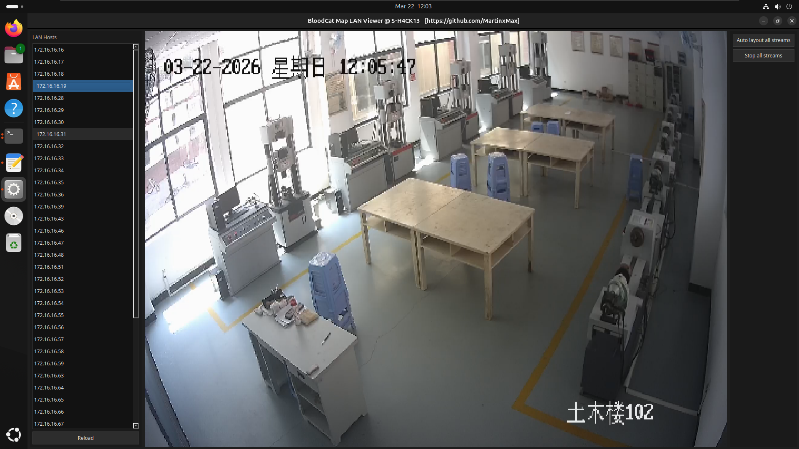

# How to Scan and Test Private Network IP Camera Security

## Network Discovery with n1ght0wl

 

https://github.com/MartinxMax/n1ght0wl/releases/download/1.0/n1ght0wl-linux-amd64

```BASH
sudo ./n1ght0wl-linux-amd64 
```
Recommendation:

Start with 192.168.x.x range (most common LAN segment)
Then move to 172.16.x.x
Finally 10.x.x.x (large enterprise networks)

Fast Mode:
--fast doubles scan speed
Trade-off: higher detection risk (more noisy traffic)



## Live Host Discovery

Option A: Using r4ven

https://github.com/MartinxMax/n1ght0wl/releases/download/1.0/r4ven-linux-amd64

```bash
$ sudo ./r4ven-linux-amd64
R4ven > load C-192/20251220.nps
R4ven > scan c9f0764370bfdea8f397ea02ec662348 554
```



Option B: Manual (Nmap)


```bash
$ sudo nmap -sn -PE -iL C-192/20260322.nps -oG - | grep "Up$" | awk '{print $2}' > ./C-192.txt
```

```bash
$ sudo nmap -sn -PE -iL B-172/20260322.nps -oG - | grep "Up$" | awk '{print $2}' > ./B-172.txt
```


```bash
$ sudo nmap -sn -PE -iL A-10/20260322.nps -oG - | grep "Up$" | awk '{print $2}' > ./A-10.txt
```

## Scan for RTSP Ports


```bash
$ nmap -p 554 -iL ./B-172.txt -oG - | awk '/554\/open/{print $2}' > ./B-172-554.txt
```

```bash
$ nmap -p 554 -iL ./A-10.txt -oG - | awk '/554\/open/{print $2}' > ./A-10-554.txt
```


```bash
$ nmap -p 554 -iL ./C-192.txt -oG - | awk '/554\/open/{print $2}' > ./C-192-554.txt
```





# Camera Identification & Credential Testing with BloodCat

https://github.com/MartinxMax/BloodCat


Run Nmap with NSE:

```bash
$ wget https://raw.githubusercontent.com/MartinxMax/BloodCat/refs/heads/main/TOP1000_RTSP_Port.txt
$ wget https://raw.githubusercontent.com/MartinxMax/BloodCat/refs/heads/main/bloodcat.nse
```

```bash
$ ips=./B-172-554.txt; nmap -Pn -p "$(cat ./TOP1000_RTSP_Port.txt | grep -oE '[0-9]+' | sort -n | uniq | paste -sd,)" --script ./bloodcat.nse -iL $ips
```



 



```bash
(bloodcat)$ python3 bloodcat.py --ips ./B-172-554.txt
```





```bash
(bloodcat)$ python3 bloodcat_map_lan.py
```





 